## The Last of Us Part 1 LiveSplit autosplitter — Installation & Configuration Guide

## Table of contents

1. [Disclaimer](#1-disclaimer)
2. [What does this script do?](#2-what-does-this-script-do)
3. [Prerequisites](#3-prerequisites)
4. [Downloading LiveSplit](#4-downloading-livesplit)
5. [Obtaining the Autosplitter script](#5-obtaining-the-autosplitter-script)
6. [Adding the Scriptable Autosplitter component to LiveSplit](#6-adding-the-scriptable-autosplitter-component-to-livesplit)
7. [Configuring autosplitter behaviour (start/split/reset)](#7-configuring-autosplitter-behaviour-start--split--reset)
8. [Testing](#8-testing)
9. [For developers](#9-for-developers)

---

## 1. Disclaimer

This autosplitter is an independent project and is not the official autosplitter for this game. It’s still in active development, and while every effort has been made to ensure it functions correctly, it may not behave perfectly in every possible situation, version, or setup.

Please use it as-is, with the understanding that some edge cases might not yet be handled. Feedback and testing reports are always appreciated — they help make the script more reliable for everyone.

If you want to use the official autosplitter instead, select it via the LiveSplit **Splits editor** window by right clicking on the LiveSplit main window, and selecting **Edit splits**.

## 2. What does this script do?

An **autosplitter** automatically starts/splits/resets LiveSplit by reading the game's state (memory, process events, or external telemetry) so the player doesn’t have to manually hit split keys.

Main Features:

- Auto-start and auto-split (obviously).
- A wide selection of split segments to choose from, including chapter completion and critical segments.
- Accurate time that matches the in-game timer throughout the entire run.
- Game-crash bullet proof: The LiveSplit timer will remain accurate even after a game crash or if the user gets out to the main menu by accident, once the run is resumed.

## 3. Prerequisites

- A Windows PC (LiveSplit is Windows-native). Some setups use Wine/Proton — outside scope.
- A version of The Last of Us Part I compatible with this autosplitter: 1.1.4.0-Steam or 1.1.5.0-Steam.
- LiveSplit (latest stable version recommended) downloaded from the <a href="https://livesplit.org/downloads/" target="_blank" rel="noopener noreferrer">official source</a>.
- Basic familiarity with LiveSplit layout editing and splitting.

Notes:
- If you plan to edit the autosplitter ASL script, you will likely need a C# editor (Visual Studio/VS Code or similar), <a href="https://learn.microsoft.com/en-us/sysinternals/downloads/debugview"  target="_blank" rel="noopener noreferrer">DebugView</a> and <a href="https://www.cheatengine.org/" target="_blank" rel="noopener noreferrer">Cheat Engine</a> (if you want to add different version offsets and base addresses).

## 4. Downloading LiveSplit

1. Visit the official <a href="https://livesplit.org/"  target="_blank" rel="noopener noreferrer">LiveSplit website</a> (or <a href="https://github.com/LiveSplit/LiveSplit" target="_blank" rel="noopener noreferrer">GitHub repo</a>) and download the latest stable release.
2. Extract the zip into a folder you control (e.g., `C:\Tools\LiveSplit` or `D:\Games\LiveSplit`).
3. Run `LiveSplit.exe` once to create default folders and settings.

## 5. Obtaining the Autosplitter script

1. Go to the code view of the ASL script <a href="https://github.com/Missing-Driver/TLOUP1-Austosplitter/blob/main/TLOU1FullAutosplitter.asl" target="_blank" rel="noopener noreferrer">here</a>.
2. At the top right corner of the code viewer, select `Download raw file`:

    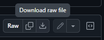

    Depending on your browser configuration, it could be downloaded directly on your `Downloads` directory or the one you select at the moment of the download; remember this location or move the script to another place you want to use it later.

## 6. Adding the Scriptable Autosplitter component to LiveSplit

1. Open LiveSplit.
2. Right-click on the window and select `Edit Layout...` to access the **Layout Editor** window:

    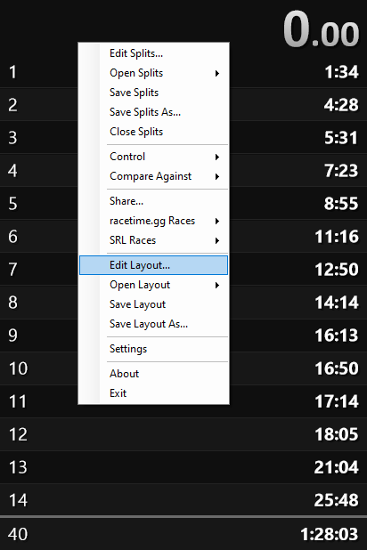
3. Click **Add**  → **Control** → **Scriptable Auto Splitter**:

    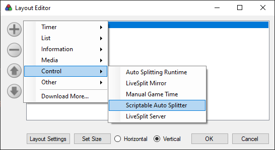

4. Once added, double click on the **Scriptable Auto Splitter** component to access the `Layout Settings` window:

    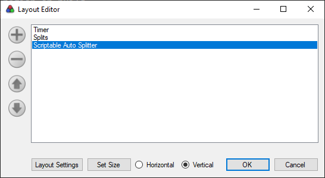

5. Click on `Browse` and find the **ASL** file you downloaded previously **(TLOU1FullAutosplitter.asl)**:

    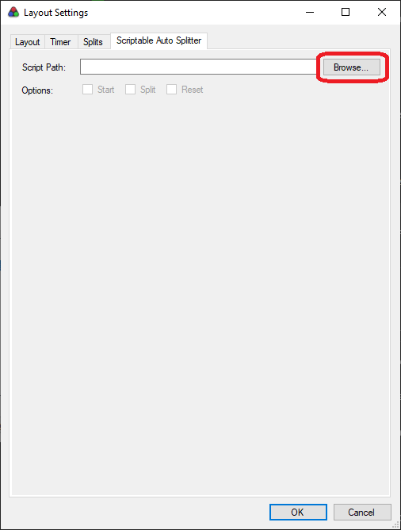

>**Note:** If your game's version doesn't match the supported ones, a popup message will appear letting you know. If that's the case, install the latest version of the game or a supported version as described in the [**Prerequisites**](#3-prerequisites) section.
This warning may also appear if you have the Developer Menu enabled. If so, disable it or ignore the warning if you’re certain your game version is the latest one.

## 7. Configuring autosplitter behaviour (start / split / reset)

Once the ASL file is correctly loaded, the **Layout Settings** window will look like this:

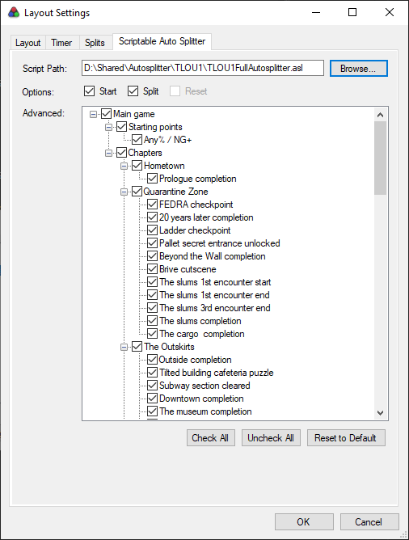

Below is an explanation of each part of this window:

### Autosplitter options
Use these checkboxes to quickly enable or disable all autosplitter actions at once:

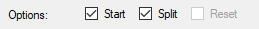

- **Start:** Enables/disables LiveSplit's ability to automatically start the timer for you.
- **Split:** Enables/disables LiveSplit's ability to automatically split for you.
- **Reset (not supported by this autosplitter):** Enables/disables LiveSplit ability to automatically reset the timer for you.

To enable/disable specific segments, keep reading...

### Advanced options
Use these checkboxes to enable/disable specific segments, in which LiveSplit will automatically perform actions for you. Hover the mouse over an option to see a small description of the element:

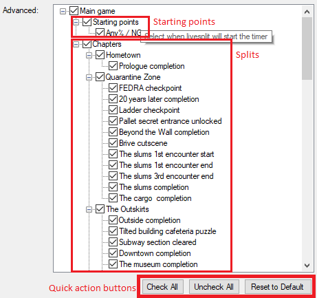

The segments are organized in:
- **Main game** splits: you can find the main game splits under this section.
    - **Starting points**: Under this section, you can activate/deactivate the specific sections where LiveSplit will **start** the timer for you, when the main **Start** option is enabled:

        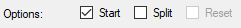

    - **Chapters**: Under this section, you can find splits organized by chapters, and activate/deactivate the specific segments where LiveSplit will **split** for you, when the main **Split** option is enabled:

        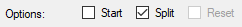

This segment list follows a hierarchical behavior like you would normally expect: Enabling/disabling a parent element will enable/disable all the children under it recursively (the enabled/disabled state will apply to all children, children of children, so on and so forth).
For example, if you disable an entire chapter, let's say "Quarantine Zone", all the splits from that game chapter will be disabled and LiveSplit will not automatically split on those segments even if the main **Split** option is enabled.
The splits that are not currently active will appear grayed out, even if they are enabled (checked):

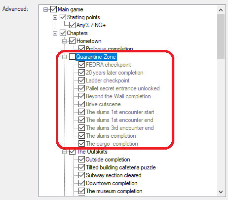

Following the same logic, if you want any of the splits to be active, its chapter parent should be enabled too, even if it is only one split under that chapter:

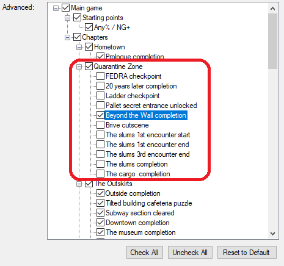

The quick action buttons at the bottom of the window will help you quickly check/uncheck all the options at once, or reset to the default configuration:

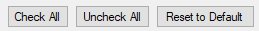

Select a starting point if you want LiveSplit to start the timer automatically for you, and the splits that match your own LiveSplit splits, including the very last one. The last split will actually stop the timer, as LiveSplit would normally behave when you manually split on the last of your splits.

>**Note:** The order of the splits doesn't matter. The autosplitter will split on the segments you select from the list, no matter the order you reach such segments, so don't worry about the order; focus on selecting the right splits that match your split file.

Once you finish enabling/disabling all you need, click on the `OK` button of this **Layout Settings** window, and then click on the `OK` button from the **Layout Editor** window.

>**Warning:** Don't click `Cancel` on any of the windows or your changes will be lost and you will have to select your splits again!

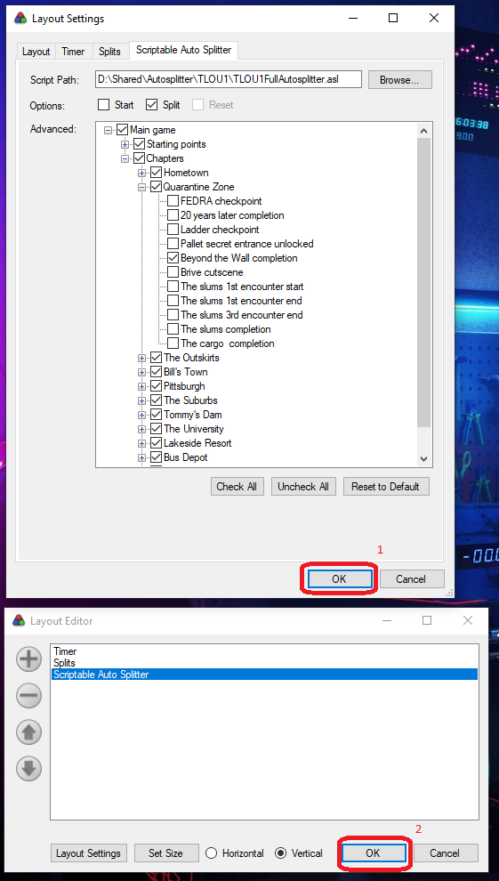

## 8. Testing

Do a test run to double check that the autosplitter is starting and splitting where you expect it to, and make adjustments to your configuration accordingly.

>**Tip:** if you have any questions that are not covered by the info expressed here, visit the [community discord](https://discord.com/invite/t4WptTQ) where you can ask for help to the community.

## 9. For developers
### Script updating
To update the autosplitter for future game patches, the signatures are included in the script so anyone can get the correct offsets for other versions (older or newer). 
Additionally, in this repo under Resources, I added a Cheat Engine script that finds the addresses automatically using the signatures.

There’s also a file called FullTaskList.txt, which contains a more extensive list of task IDs that can be used to add new splits to the script. Many of them are self-explanatory, for example: hom-house-downstairs.
They match the names in the developer menu, so if you have it unlocked, you can get a more exact idea of where those segments start and end.

### Script functionality summary
The script uses the task ID string ("task" in the ASL script) to split, and the game's logic to update the timer. 
The game stores the current chapter time in a 8-byte double value ("segmentTime" in the ASL script); when a chapter is completed, it saves the completion time into a slot within an array of 4-byte values ("timeListBase" + 0xDA640 in the ASL script, 30 slots in total for The Last of Us part 1) and then resets the current chapter time to 0. 
The game then updates the in-game speedrun timer on the fly, by constantly adding all the completion times + the current segment time the following way: 
It multiplies by 1000 the double segment time value to get the milliseconds, then truncates the result to keep it as an integer, and adds it to the sum of saved times. 
Since the in-game timer only displays hundreds of milliseconds, the game rounds the time to the nearest 100ms. 
The same system is implemented in this script to calculate the in-game time.